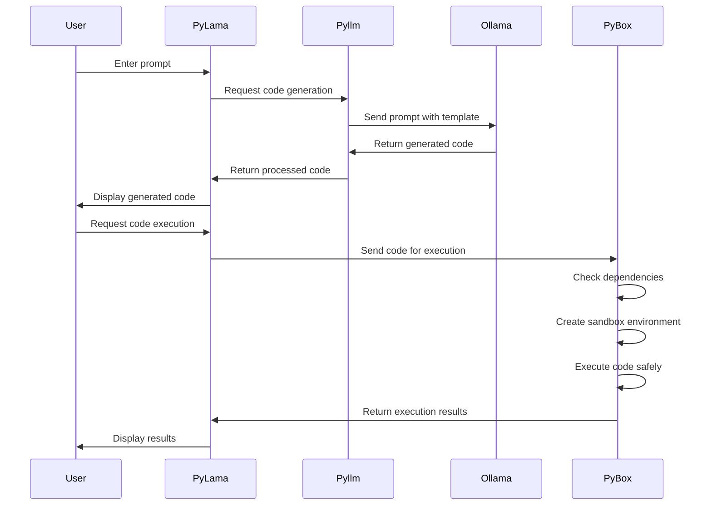

# PyLama - Python Code Generation with Ollama

PyLama is a Python tool that leverages Ollama's language models to generate and execute Python code. It simplifies the process of writing and running Python scripts by handling dependency management and code execution automatically. With the new template system, it generates higher quality, platform-aware code that's ready to run.

# PyLama Microservices Architecture

## Overview

This repository contains a microservices-based architecture for the PyLama ecosystem, consisting of the following components:

- **PyBox**: Python code execution sandbox
- **PyLLM**: LLM operations service
- **PyLama**: Ollama management service
- **SheLLama**: Shell and filesystem operations service
- **APILama**: API gateway for all services
- **WebLama**: Web frontend (JavaScript/HTML/CSS)

The architecture has been refactored to improve maintainability, scalability, and separation of concerns. Each component now exposes a REST API that can be consumed by other services through the APILama gateway.

## Architecture

The PyLama ecosystem is built around a central orchestration service (PyLama) that coordinates all other components. This architecture allows for better integration and simplified deployment.

```
                   +------------+
                   |   Ollama   |
                   |   (LLM)    |
                   +------------+
                        ^
                        |
                        v
+------------+     +------------+     +---------------+     +------------+
|   PyBox    |     |   PyLLM    |<--->|   PyLama      |<--->| SheLLama   |
|  (Sandbox) |<--->|   (LLM)    |     | (Orchestrator)|     |  (Shell)   |
+------------+     +------------+     +---------------+     +------------+
      ^                  ^                  ^                  ^
      |                  |                  |                  |
      v                  v                  v                  v
+-----------------------------------------------------------------------+
|                            APILama                                    |
|                          (API Gateway)                                |
+-----------------------------------------------------------------------+
                                ^
                                |
                                v
+-----------------------------------------------------------------------+
|                            WebLama                                    |
|                           (Frontend)                                  |
+-----------------------------------------------------------------------+
                                ^
                                |
                                v
+-----------------------------------------------------------------------+
|                            Browser                                    |
+-----------------------------------------------------------------------+
```

## Services

### PyBox (Port 8000)

Python code execution sandbox service that provides:
- Code execution in isolated environments
- Dependency management
- Code analysis

### PyLLM (Port 8001)

LLM operations service that provides:
- LLM model queries
- Code fixing functionality
- Alternative fix generation

### SheLLama (Port 8002)

Shell and filesystem operations service that provides:
- File operations (read, write, list, search)
- Directory management
- Shell command execution
- Git integration for version control

### APILama (Port 8080)

API gateway service that provides:
- Unified API for all services
- Request routing to appropriate services
- Health monitoring
- Logging and error handling

### WebLama (Static Frontend)

Web frontend that provides:
- User interface for interacting with the services
- Code editor with syntax highlighting
- File explorer
- Execution results display

### PyLama (Port 8003)

Ollama management service that provides:
- Model management
- Model inference
- Model fine-tuning

## Getting Started

### Prerequisites

- Docker and Docker Compose (recommended for easy deployment)
- Python 3.8 or higher (for development without Docker)
- Node.js 14 or higher (for WebLama frontend development)
- Git

### Docker Deployment (Recommended)

The easiest way to run the entire PyLama ecosystem is using Docker Compose, which will set up all components with the correct configuration and dependencies.

1. Clone the repository:
   ```bash
   git clone https://github.com/py-lama/pylama.git
   cd py-lama
   ```

2. Start all services with Docker Compose:
   ```bash
   docker-compose up -d
   ```
   This will start all components in the correct order with PyLama as the central orchestration point.

3. Access the web interface:
   - Open your browser and navigate to `http://localhost:80`

4. Monitor the logs:
   ```bash
   docker-compose logs -f
   ```

5. Stop all services:
   ```bash
   docker-compose down
   ```

### Manual Installation (Development)

For development purposes, you can set up each component individually.

1. Clone the repository:
   ```bash
   git clone https://github.com/py-lama/pylama.git
   cd py-lama
   ```

2. Set up each component:

   #### PyLama (Central Orchestration Service)
   ```bash
   cd pylama
   python -m venv venv
   source venv/bin/activate  # On Windows: venv\Scripts\activate
   pip install -e .
   ```

   #### APILama (API Gateway)
   ```bash
   cd apilama
   python -m venv venv
   source venv/bin/activate  # On Windows: venv\Scripts\activate
   pip install -e .
   ```

   #### SheLLama (Shell Operations)
   ```bash
   cd shellama
   python -m venv venv
   source venv/bin/activate  # On Windows: venv\Scripts\activate
   pip install -e .
   ```

   #### PyBox (Sandbox)
   ```bash
   cd pybox
   python -m venv venv
   source venv/bin/activate  # On Windows: venv\Scripts\activate
   pip install -e .
   ```

   #### PyLLM (LLM Operations)
   ```bash
   cd pyllm
   python -m venv venv
   source venv/bin/activate  # On Windows: venv\Scripts\activate
   pip install -e .
   ```

   #### WebLama (Frontend)
   ```bash
   cd weblama
   npm install
   ```

### Running the Services Manually

If you're not using Docker, start the services in the following order:

1. **PyBox** (Sandbox):
   ```bash
   cd pybox
   source venv/bin/activate  # On Windows: venv\Scripts\activate
   python -m pybox.app --port 8000 --host 127.0.0.1
   ```

2. **PyLLM** (LLM Operations):
   ```bash
   cd pyllm
   source venv/bin/activate  # On Windows: venv\Scripts\activate
   python -m pyllm.app --port 8001 --host 127.0.0.1
   ```

3. **APILama** (API Gateway):
   ```bash
   cd apilama
   source venv/bin/activate  # On Windows: venv\Scripts\activate
   python -m apilama.app --port 8080 --host 127.0.0.1
   ```
   Note: APILama will automatically use SheLLama as a library.

4. **PyLama** (Central Orchestration):
   ```bash
   cd pylama
   source venv/bin/activate  # On Windows: venv\Scripts\activate
   python -m pylama.app --port 8003 --host 127.0.0.1
   ```
   PyLama coordinates all other services and provides a unified interface.

5. **WebLama** (Frontend):
   ```bash
   cd weblama
   npm start
   ```
   Or serve the static files with a web server of your choice.

6. Access the web interface:
   - Open your browser and navigate to `http://localhost:8080` (or whatever port you configured for the WebLama frontend)

## API Documentation

### APILama Endpoints

#### Health Check
```
GET /api/health
```
Returns the health status of the APILama service.

#### PyLama Endpoints
```
GET /api/pylama/health
POST /api/pylama/execute
```

#### PyBox Endpoints
```
GET /api/pybox/health
POST /api/pybox/execute
```

#### PyLLM Endpoints
```
GET /api/pyllm/health
POST /api/pyllm/generate
```

#### SheLLama Endpoints
```
GET /api/shellama/health
GET /api/shellama/files
GET /api/shellama/file
POST /api/shellama/file
DELETE /api/shellama/file
GET /api/shellama/directory
POST /api/shellama/directory
DELETE /api/shellama/directory
POST /api/shellama/shell
```

## Development

### Adding a New Service

To add a new service to the ecosystem:

1. Create a new directory for your service
2. Implement the service with a REST API
3. Add routes to APILama to proxy requests to your service
4. Update the WebLama frontend to interact with your service through APILama

### Testing

Each service has its own test suite. To run the tests for a service:

```bash
cd <service-directory>
python -m unittest discover tests
```

To run the integration tests for the entire ecosystem:

```bash
python integration_test.py
```

## Benefits of the Microservices Architecture

1. **Modularity**: Each service can be developed, deployed, and scaled independently
2. **Scalability**: Services can be scaled based on demand
3. **Maintainability**: Clearer separation of concerns
4. **Deployment Flexibility**: Components can be deployed separately or together
5. **Language Agnostic**: Future components could be written in different languages


## Using the Makefile

PyLama includes a Makefile to simplify common development tasks:

```bash
# Set up the project (creates a virtual environment and installs dependencies)
make setup

# Run the API server (default port 8002)
make run

# Run the API server on a custom port
make run PORT=8080

# The run-port command is also available for backward compatibility
make run-port PORT=8080

# Run tests
make test

# Format code with black
make format

# Lint code with flake8
make lint

# Clean up project (remove __pycache__, etc.)
make clean

# Show all available commands
make help
```

## Project Structure and Dependencies

PyLama is built on a modular architecture with three main components:

### Architecture Overview

```
+----------------+     +----------------+     +----------------+
|                |     |                |     |                |
|     PyLama     |---->|     PyLLM     |     |     PyBox      |
|                |     |                |     |                |
+----------------+     +----------------+     +----------------+
        |                                            ^
        |                                            |
        +--------------------------------------------+
```

### Component Relationships (Mermaid Diagram)


### Core Components

1. **PyLama Package** - Main application
   - Provides CLI interface for code generation
   - Manages templates for different code generation scenarios
   - Coordinates between PyLLM and PyBox

2. **PyLLM Package** - LLM integration
   - Handles communication with Ollama API
   - Manages model selection and configuration
   - Processes prompts and extracts code from responses

3. **PyBox Package** - Sandbox for code execution
   - Provides safe execution environments (Python and Docker)
   - Manages dependencies for generated code
   - Analyzes code for security and performance

### Directory Structure

```
pylama/
├── pylama/              # Main package directory
│   ├── __init__.py     # Package initialization
│   ├── cli.py          # Command-line interface
│   ├── pylama.py       # Core functionality
│   ├── OllamaRunner.py # Ollama API integration
│   ├── templates.py    # Template management
│   ├── dependency_utils.py # Dependency utilities
│   └── examples/       # Example code templates
│       ├── web_server.py
│       ├── file_io.py
│       ├── api_request.py
│       ├── database.py
│       └── default.py
├── tests/              # Test directory
│   ├── __init__.py
│   ├── test_templates.py
│   ├── test_cli.py
│   └── test_pylama.py
├── pyproject.toml      # Project configuration
└── setup.py            # Installation script
```

### Module Interactions


### Implementation Details

#### PyLama Core (pylama.py)

The core module coordinates all functionality:

- **check_ollama()**: Verifies Ollama is running
- **generate_code()**: Generates Python code from prompts
- **execute_code()**: Executes the generated code
- **save_code_to_file()**: Saves code to a file

#### Template System (templates.py)

Provides templates for different code generation scenarios:

- **basic**: Simple code generation
- **platform_aware**: Adapts code to the current platform
- **dependency_aware**: Includes necessary dependencies
- **testable**: Includes test functions
- **secure**: Adds security checks
- **performance**: Optimizes for performance
- **pep8**: Follows PEP 8 style guidelines

#### Dependency Management

PyLama uses a sophisticated dependency management system:

1. **Direct Dependencies**:
   - **PyLama** depends on core Python libraries and utilities like `requests` and `python-dotenv`
   - Development dependencies include `pytest`, `black`, and `flake8`

2. **External Package Dependencies**:
   - **PyLLM**: Used for model management and LLM integration
   - **PyBox**: Used for code execution and sandbox functionality

3. **Dynamic Import System**:
   - PyLama uses dynamic imports to locate and use PyLLM and PyBox
   - The system first tries to find packages in the standard Python path
   - If not found, it looks for them in the parent directory (development mode)
   - This approach allows flexibility in both development and production environments

### Installation Process

PyLama can be installed in two ways:

#### 1. Development Mode

For development, all three packages (PyLama, PyLLM, PyBox) should be installed in development mode:

```bash
# Clone the repositories
git clone https://github.com/py-lama/pylama.git
git clone https://github.com/py-lama/pyllm.git
git clone https://github.com/py-lama/pybox.git

# Install in development mode
cd py-lama/pylama
pip install -e .
cd ../../pyllm
pip install -e .
cd ../pybox
pip install -e .
```

This setup allows changes in any package to be immediately available to the others.

#### 2. Production Installation

For end users, PyLama can be installed directly from PyPI:

```bash
pip install pylama
```

This will install PyLama along with its dependencies, including PyLLM and PyBox.

## Examples

```bash
# After installation
pylama "create a simple hello world program"

# Or run directly from the source directory
python -m pylama.cli "create a simple hello world program"
```

This will generate a Python script that prints "Hello, World!" and execute it.

### Interactive Mode

```bash
pylama -i
```

This launches PyLama in interactive mode, allowing you to:
- Generate code with different prompts
- Switch between models
- Change templates
- Save and run generated code

### Specifying a Template

```bash
pylama -t dependency_aware -d "requests,beautifulsoup4" "create a web scraper for news headlines"
```

This will generate a web scraper using the specified dependencies.

### Additional Options

```bash
pylama -m "codellama:7b" -t testable -s -r "create a function to calculate fibonacci numbers"
```

This will:
- Use the codellama:7b model
- Generate code with the testable template
- Save the code to a file (-s)
- Run the generated code (-r)

- `prompt`: The task description for code generation (can be provided as positional arguments)
- `-t, --template`: Choose a template type for code generation (default: platform_aware)
  - Available templates: basic, platform_aware, dependency_aware, testable, secure, performance, pep8
- `-d, --dependencies`: Specify allowed dependencies (for dependency_aware template)
- `-m, --model`: Specify which Ollama model to use (default: llama3)


## Features

- **AI-Powered Code Generation** - Generate Python code using Ollama's language models
- **Template System** - Use specialized templates for different coding needs (security, performance, testing)
- **Platform-Aware Code** - Generate code optimized for your specific operating system
- **Automatic Dependency Management** - Automatically detects and installs required Python packages
- **Code Execution** - Run generated code in a controlled environment
- **Error Handling** - Automatic error detection and debugging suggestions with specialized templates
- **Modular Architecture** - Separated components for better maintainability with independent packages

## Prerequisites

- Python 3.8+
- [Ollama](https://ollama.com/) installed and running locally
- At least one Ollama model (e.g., llama3, llama2, mistral)

## Installation

### Prerequisites

- Python 3.8 or higher
- [Ollama](https://ollama.ai/) installed and running

### Installation Steps

1. Clone the repository:
   ```bash
   git clone https://github.com/py-lama/pylama.git
   cd pylama
   ```

2. Install the packages in development mode:
   ```bash
   # Install the PyBox package
   cd pybox
   pip install -e .
   
   # Install the Pyllm package
   cd ../pyllm
   pip install -e .
   
   # Install the main PyLama application
   cd ../pylama
   pip install -e .
   ```

   > **Note:** If you encounter issues with Poetry, you can install directly with pip:
   > ```bash
   > pip install -e ../pybox
   > pip install -e ../pyllm
   > pip install -e .
   > ```

3. Ensure Ollama is running:
   ```bash
   ollama serve
   ```

4. Install at least one code generation model:
   ```bash
   ollama pull codellama:7b
   # or a smaller model if you have limited resources
   ollama pull phi:2.7b
   ```

### Workflow Diagram



## Usage

### Basic Usage

```bash
python pylama.py
```

## Model Management (models.py)

- **Automatic Environment & Dependency Setup:**
  - Running `models.py` will auto-create a `.venv` and install required dependencies (`requests`, `bs4`, `python-dotenv`) if missing.
  - No manual pip/venv setup required—just run the script.
- **Model List Updating:**
  - Models are fetched directly from the [Ollama library](https://ollama.com/library) (HTML scraping), not from a static JSON.
  - Only coding-related models up to 7B parameters are shown.
  - Use the interactive CLI to update the list (`u`), install by number, or quit (`q`).
- **Immediate Feedback:**
  - Installed models are listed at startup for quick reference.

## Python Sandbox (sandbox package)

- **Modular Architecture:**
  - Refactored into specialized components for better maintainability and organization:
    - `code_analyzer.py`: Analyzes Python code and detects dependencies
    - `dependency_manager.py`: Manages package dependencies and installations
    - `python_sandbox.py`: Executes Python code safely in a local environment
    - `docker_sandbox.py`: Executes Python code in a Docker container
    - `sandbox_manager.py`: Manages different sandbox types
    - `utils.py`: Provides utility functions for the sandbox package
- **Automatic Dependency Management:**
  - The sandbox analyzes Python code, detects imports, and installs missing packages automatically (locally or in Docker).
- **Safe & Flexible Execution:**
  - Run code locally or in a Docker container for isolation (choose with `use_docker=True/False`).
  - Handles syntax errors and runtime exceptions with clear error messages.
  - Execution timeout can be set to avoid hanging code.
- **Backward Compatibility:**
  - Original `sandbox.py` serves as a compatibility layer for existing code.
- **Usage Example:**
  ```python
  # Using the new modular structure
  from sandbox.python_sandbox import PythonSandbox
  sandbox = PythonSandbox(use_docker=False)
  result = sandbox.run_code('import numpy as np\nprint(np.arange(5))')
  print(result['stdout'])
  
  # Using the compatibility layer (for existing code)
  from sandbox import run_code
  result = run_code('import numpy as np\nprint(np.arange(5))')
  print(result['stdout'])
  ```

## Project Structure

PyLama has been restructured into a modular architecture with three main components:

### Architecture Overview


### Component Structure

```
┌─────────────────────────────────┐
│           PyLama Core           │
├─────────────────────────────────┤
│ ┌─────────┐      ┌───────────┐ │
│ │ CLI     │      │ Templates │ │
│ └─────────┘      └───────────┘ │
│ ┌─────────────────────────────┐ │
│ │      Code Generation        │ │
│ └─────────────────────────────┘ │
└───────────────┬─────────────────┘
                │
    ┌───────────┴───────────┐
    │                       │
┌───▼───────────┐   ┌──────▼─────────┐
│  Pyllm Package │   │ PyBox Package  │
├────────────────┤   ├────────────────┤
│ ┌────────────┐ │   │ ┌────────────┐ │
│ │ Models     │ │   │ │ Sandboxes  │ │
│ └────────────┘ │   │ └────────────┘ │
│ ┌────────────┐ │   │ ┌────────────┐ │
│ │ API Client │ │   │ │ Analyzers  │ │
│ └────────────┘ │   │ └────────────┘ │
└────────────────┘   └────────────────┘
```

### Components Details

1. **Core PyLama** - The main application
   - `pylama.py`: Main script for the application
   - `DependencyManager.py`: Manages Python package dependencies
   - `OllamaRunner.py`: Handles interaction with the Ollama API
   - `templates.py`: Contains templates for code generation
   - `cli.py`: Command-line interface for the application

2. **PyBox Package** - Sandbox for safe code execution
   - `code_analyzer.py`: Analyzes Python code and detects dependencies
   - `dependency_manager.py`: Manages package dependencies and installations
   - `python_sandbox.py`: Executes Python code safely in a local environment
   - `docker_sandbox.py`: Executes Python code in a Docker container
   - `sandbox_manager.py`: Manages different sandbox types
   - `utils.py`: Provides utility functions for the sandbox

3. **Pyllm Package** - Model management for LLMs
   - `models.py`: Handles model discovery, installation, and configuration
   - Functions for model management: `get_models()`, `get_default_model()`, `set_default_model()`, etc.

### Package Dependencies

The modular architecture allows each component to be developed, tested, and maintained independently:

- **PyLama Core** depends on both PyBox and Pyllm packages
- **PyBox** is independent and can be used in other projects for safe code execution
- **Pyllm** is independent and can be used in other projects for LLM model management

This separation of concerns makes the codebase more maintainable and allows for better testing and development workflows.

## Advanced Usage

### Using PyBox for Code Execution

```python
from pybox import PythonSandbox, DockerSandbox

# Run code in a Python sandbox
sandbox = PythonSandbox()
result = sandbox.run_code("print('Hello, World!')")
print(result['output'])

# Run code in a Docker sandbox for better isolation
docker_sandbox = DockerSandbox()
result = docker_sandbox.run_code("print('Hello from Docker!')")
print(result['output'])
```

### Using Pyllm for Model Management

```python
from pyllm import get_models, get_default_model, set_default_model, install_model

# Get available models
models = get_models()
for model in models:
    print(f"{model['name']} - {model.get('desc', '')}")

# Get the current default model
default_model = get_default_model()
print(f"Current default model: {default_model}")

# Set a new default model
set_default_model("codellama:7b")

# Install a model
install_model("deepseek-coder:6.7b")
```

### Custom Templates

## How It Works

1. The tool analyzes your prompt and selects the appropriate template based on your requirements
2. It enhances your prompt with template-specific instructions for the Ollama model
3. The template-enhanced prompt is sent to the specified Ollama model to generate Python code
4. It extracts import statements to identify required dependencies
5. It checks for and installs any missing dependencies
6. The generated code is executed in a controlled environment
7. Any errors are caught and a specialized debug template is used to regenerate improved code

## Configuration

Create a `.env` file in the project root to customize behavior:

```env
OLLAMA_MODEL=llama3
OLLAMA_FALLBACK_MODELS=phi3,llama2
LOG_LEVEL=INFO
USE_DOCKER=False
```

## Development and Testing

### Testing the Packages

Both PyBox and Pyllm packages come with comprehensive test suites using pytest and tox:

```bash
# Test the PyBox package
cd pybox
python -m pytest  # Run tests with pytest
python -m pytest --cov=pybox  # Run tests with coverage report
tox  # Run tests across multiple Python versions

# Test the Pyllm package
cd pyllm
python -m pytest  # Run tests with pytest
python -m pytest --cov=pyllm  # Run tests with coverage report
tox  # Run tests across multiple Python versions
```

### Development Workflow

When developing new features or fixing bugs:

1. Make changes to the appropriate package (PyLama core, PyBox, or Pyllm)
2. Run the tests for that package
3. Update documentation if necessary
4. Submit a pull request

## Contributing

Contributions are welcome! Please feel free to submit a Pull Request.

## License

This project is licensed under the Apache License, Version 2.0 - see the [LICENSE](LICENSE) file for details.

```
Copyright 2025 PyLama Team

Licensed under the Apache License, Version 2.0 (the "License");
you may not use this file except in compliance with the License.
You may obtain a copy of the License at

    http://www.apache.org/licenses/LICENSE-2.0

Unless required by applicable law or agreed to in writing, software
distributed under the License is distributed on an "AS IS" BASIS,
WITHOUT WARRANTIES OR CONDITIONS OF ANY KIND, either express or implied.
See the License for the specific language governing permissions and
limitations under the License.
```

## Template System

PyLama includes a powerful template system that helps generate better quality code for different scenarios:

### Available Templates

- **basic** - Simple code generation with standard best practices
- **platform_aware** - Generates code optimized for your specific operating system
- **dependency_aware** - Creates code using only specified dependencies
- **testable** - Includes unit tests with the generated code
- **secure** - Focuses on security best practices and input validation
- **performance** - Optimizes code for better performance
- **pep8** - Ensures code follows Python PEP 8 style guidelines

### Debug Template

When errors occur in generated code, PyLama uses a specialized debug template to analyze and fix the issues automatically.

## Wymagania

- Python 3.8+ (skrypt wykryje i zainstaluje zależności)
- [Ollama](https://ollama.com/download)
- Co najmniej jeden model Ollama (np. tinyllama, llama3, qwen, phi)

## Szybki start

1. **Pobierz i utwórz skrypt:**

   ```bash
   # Zapisz skrypt jako setup.sh
   chmod +x setup.sh
   ```

2. **Uruchom z pełną konfiguracją:**

   ```bash
   ./setup.sh
   ```

   Skrypt automatycznie:
   - Sprawdzi i zainstaluje wymagane pakiety Python
   - Sprawdzi instalację Ollama
   - Pomoże w konfiguracji modeli
   - Uruchomi serwer API

3. **Lub tylko uruchom serwer (jeśli już skonfigurowany):**

   ```bash
   ./setup.sh --run
   ```

## Dostępne opcje

Skrypt oferuje kilka przydatnych opcji:

```bash
# Wyświetlenie pomocy
./setup.sh --help

# Tylko konfiguracja środowiska (bez uruchamiania)
./setup.sh --setup

# Tylko uruchomienie serwera
./setup.sh --run

# Uruchomienie na niestandardowym porcie
./setup.sh --run --port 8080

# Zarządzanie modelami Ollama
./setup.sh --models

# Sprawdzenie wymagań systemowych
./setup.sh --check
```

## Interfejs webowy

Po uruchomieniu serwera, interfejs webowy jest dostępny pod adresem:

```
http://localhost:5001
```

Interfejs pozwala na:
- Zadawanie pytań do modelu
- Zmianę parametrów generowania
- Przeglądanie dostępnych modeli

## API REST

Serwer udostępnia następujące endpointy:

### `POST /ask`

Wysyła zapytanie do modelu Ollama.

**Żądanie**:
```json
{
  "prompt": "Co to jest Python?",
  "temperature": 0.7,
  "max_tokens": 1000
}
```

**Odpowiedź**:
```json
{
  "response": "Python to wysokopoziomowy, interpretowany język programowania..."
}
```

### `GET /models`

Pobiera listę dostępnych modeli Ollama.

**Odpowiedź**:
```json
{
  "models": [
    {
      "name": "tinyllama:latest",
      "size": 1640,
      "current": true
    },
    {
      "name": "llama3:latest",
      "size": 3827,
      "current": false
    }
  ]
}
```

### `POST /echo`

Proste narzędzie do testowania działania serwera.

**Żądanie**:
```json
{
  "message": "Test"
}
```

**Odpowiedź**:
```json
{
  "response": "Otrzymano: Test"
}
```

## Używanie z cURL

```bash
# Zapytanie do modelu
curl -X POST -H "Content-Type: application/json" \
     -d '{"prompt":"Co to jest Python?"}' \
     http://localhost:5001/ask

# Pobranie listy modeli
curl http://localhost:5001/models

# Test echo
curl -X POST -H "Content-Type: application/json" \
     -d '{"message":"Test"}' \
     http://localhost:5001/echo
```

## Plik konfiguracyjny .env

Skrypt tworzy plik `.env` z ustawieniami, które możesz edytować:

```
# Konfiguracja modelu Ollama
MODEL_NAME="tinyllama:latest"

# Konfiguracja serwera
OLLAMA_URL="http://localhost:11434"
SERVER_PORT=5001

# Parametry generowania
TEMPERATURE=0.7
MAX_TOKENS=1000
```

## Obsługiwane modele

Skrypt działa z wszystkimi modelami dostępnymi w Ollama. Oto szczegółowa lista najpopularniejszych modeli:

| Model | Rozmiar | Przeznaczenie |
|-------|---------|---------------|
| **llama3** | 8B | Ogólnego przeznaczenia, dobry do większości zadań |
| **phi3** | 3.8B | Szybki, dobry do prostszych zadań, zoptymalizowany pod kątem kodu |
| **mistral** | 7B | Ogólnego przeznaczenia, efektywny energetycznie |
| **gemma** | 7B | Dobry do zadań języka naturalnego i kreatywnego pisania |
| **tinyllama** | 1.1B | Bardzo szybki, idealny dla słabszych urządzeń |
| **qwen** | 7-14B | Dobry w analizie tekstu, wsparcie dla języków azjatyckich |
| **llava** | 7-13B | Multimodalny z obsługą obrazów - pozwala na analizę obrazów i tekstu |
| **codellama** | 7-34B | Wyspecjalizowany model do kodowania - świetny do generowania i analizy kodu |
| **vicuna** | 7-13B | Wytrenowany na konwersacjach, dobry do dialogów |
| **falcon** | 7-40B | Szybki i efektywny, dobry stosunek wydajności do rozmiaru |
| **orca-mini** | 3B | Dobry do podstawowych zadań NLP |
| **wizardcoder** | 13B | Stworzony do zadań związanych z kodem |
| **llama2** | 7-70B | Poprzednia generacja modelu Meta, sprawdzony w różnych zastosowaniach |
| **stablelm** | 3-7B | Dobry do generowania tekstu i dialogów |
| **dolphin** | 7B | Koncentruje się na naturalności dialogów |
| **neural-chat** | 7-13B | Zoptymalizowany pod kątem urządzeń Intel |
| **starling** | 7B | Mniejszy ale skuteczny, zoptymalizowany pod kątem jakości odpowiedzi |
| **openhermes** | 7B | Dobra dokładność, postępowanie zgodnie z instrukcjami |
| **yi** | 6-34B | Zaawansowany model wielojęzyczny |

### Wybór rozmiaru modelu

Przy wyborze własnego modelu, warto rozważyć różne rozmiary:

- **Mini (1-3B)**: Bardzo małe modele - szybkie, ale ograniczone możliwości
- **Small (3-7B)**: Małe modele - dobry kompromis szybkość/jakość
- **Medium (8-13B)**: Średnie modele - lepsze odpowiedzi, wymaga więcej RAM
- **Large (30-70B)**: Duże modele - najlepsza jakość, wysokie wymagania sprzętowe

### Wymagania sprzętowe

Poniżej orientacyjne wymagania sprzętowe dla różnych rozmiarów modeli:

| Rozmiar modelu | Minimalna ilość RAM | Zalecana ilość RAM | GPU |
|----------------|---------------------|-------------------|-----|
| Mini (1-3B) | 4GB | 8GB | Opcjonalnie |
| Small (3-7B) | 8GB | 16GB | Zalecany |
| Medium (8-13B) | 16GB | 24GB | Zalecany ≥4GB VRAM |
| Large (30-70B) | 32GB | 64GB | Wymagany ≥8GB VRAM |

## FAQ

- **Q: Do I need to install anything before running `models.py`?**
  - A: No, the script will auto-create a venv and install dependencies if needed.
- **Q: How do I update the model list?**
  - A: Run `models.py` and press `u` in the menu.
- **Q: How do I run code with sandbox.py?**
  - A: See the usage example above. Dependencies are managed automatically.
