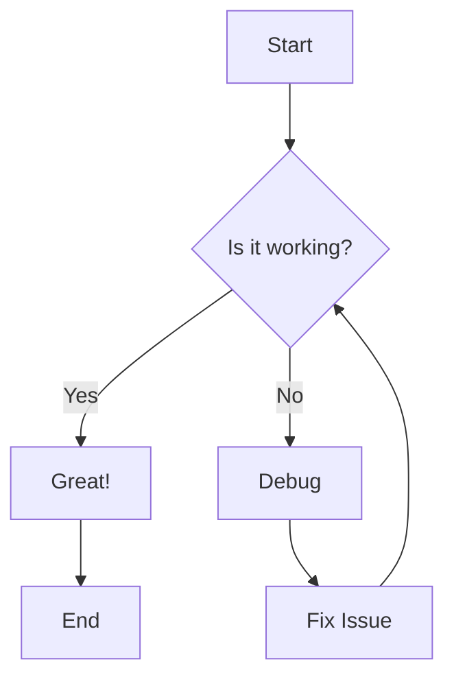

# Mermaid and Code Blocks Example

## Mermaid Diagram Example



## Code Examples in Different Languages

### Python Example 1: Hello World

```python
# A simple Hello World program
print("Hello, World!")
```

### Python Example 2: List Manipulation

```python
# List manipulation with a bug - fixed
numbers = [1, 2, 3, 4, 5]
# Using a safer approach with direct iteration
for number in numbers:
    print(number)
```

### Python Example 3: File Operations with Syntax Error

```python
# File operations with syntax error - fixed
def write_to_file(filename, content):
    with open(filename, 'w') as file:
        file.write(content)
    print(f"Content written to {filename}")

write_to_file("example.txt", "Hello, this is a test!")
```

### JavaScript Example

```javascript
// A simple JavaScript function
function greet(name) {
    return `Hello, ${name}!`;
}

console.log(greet("JavaScript"));
```

### SQL Example

```sql
-- A simple SQL query
SELECT name, age 
FROM users
WHERE age > 18
ORDER BY name ASC;
```

### Java Example

```java
// A simple Java class
public class HelloWorld {
    public static void main(String[] args) {
        System.out.println("Hello, Java!");
    }
}
```

### Python Example 4: Complex Function with Logic Error

```python
# A function to find the largest number in a list - fixed
def find_largest(numbers):
    if not numbers:
        return None
    
    largest = numbers[0]
    for num in numbers:
        # Fixed: changed '<' to '>' to correctly find the largest number
        if num > largest:
            largest = num
    
    return largest

# Test the function
numbers = [5, 10, 3, 8, 15]
result = find_largest(numbers)
print(f"The largest number is: {result}")
```

### Python Example 5: API Request with Missing Import

```python
# API request example with missing import - fixed
import requests

def get_data_from_api(url):
    response = requests.get(url)
    if response.status_code == 200:
        return response.json()
    else:
        return None

api_url = "https://jsonplaceholder.typicode.com/posts/1"
data = get_data_from_api(api_url)
if data:
    print(f"Title: {data['title']}")
    print(f"Body: {data['body']}")
else:
    print("Failed to fetch data")
```
